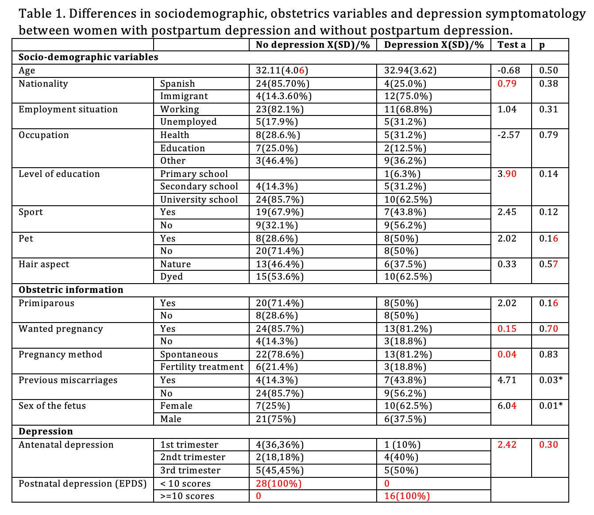
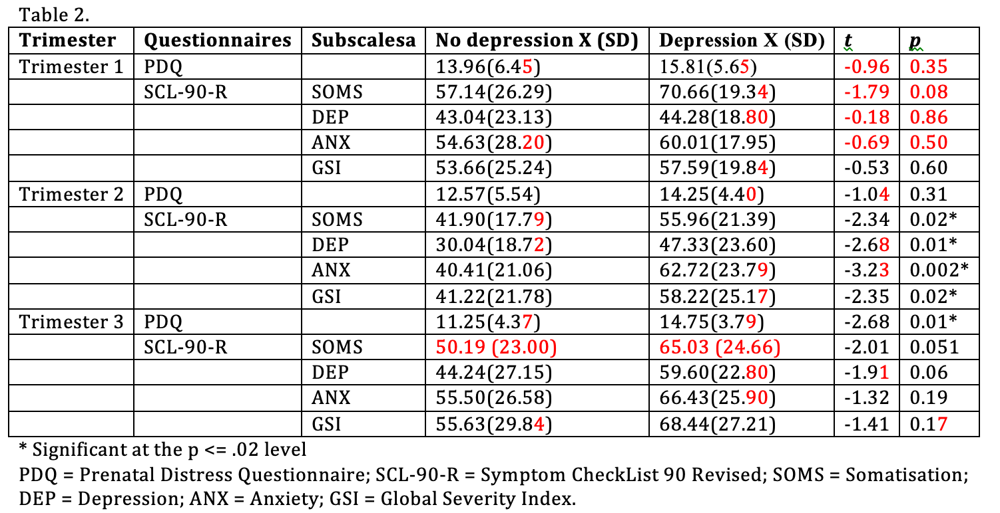
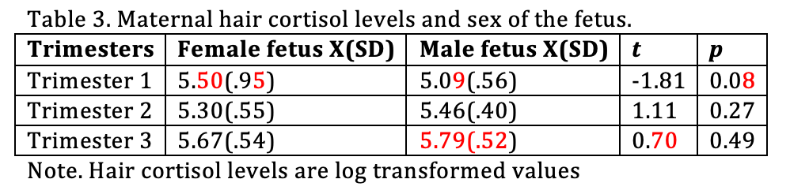
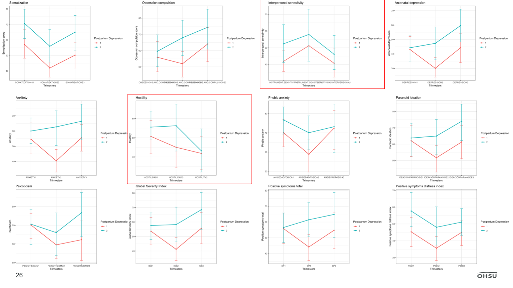
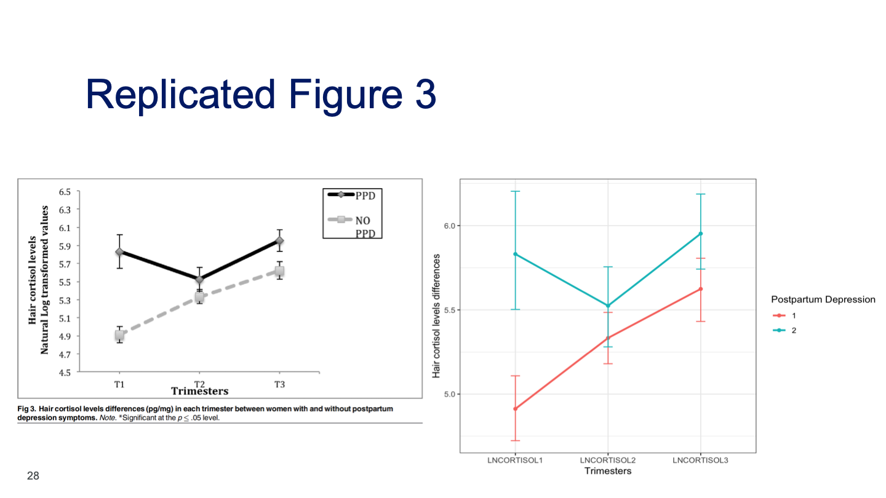

```{r setup, include=FALSE}
knitr::opts_chunk$set(echo = TRUE)
library(infer)
library(dplyr)
library(tidyr)
library(ggplot2)
library(GGally)
library(tidyverse)
library(DescTools)
```

# OVERVIEW

### PAPER: [Hair cortisol levels, psychological stress and psychopathological symptoms as predictors of postpartum depression](https://journals.plos.org/plosone/article?id=10.1371/journal.pone.0182817) 
### ORIGINAL DATA: [sav file](https://figshare.com/articles/PPD_hairCortisol_PlosOne_sav/5255848/1) 
### TIDY DATA: [csv file](https://github.com/OHSU-Math630/FINAL_PROJECT/tree/master/data/tidy_data.csv)
### CODE BOOK: [knitted html](https://github.com/OHSU-Math630/FINAL_PROJECT/tree/master/postpartum_depression_prediction/P2/group7_codebook.html)

#### The purpose of this R markdown script is to explore the data provided by this paper. If desired, all materials can be seen at our [github repository.](https://github.com/OHSU-Math630/FINAL_PROJECT) 

## Paper Abstract   

Postpartum depression affects a huge number of women and has detrimental consequences. Knowing the factors associated with postpartum depression during pregnancy can help its prevention. Although there is evidence surrounding behavioral or psychological predictors of postpartum depression, there is a lack of evidence of biological forecasters. The aim of this study was to analyze the sociodemographic, obstetric, and psychological variables along with hair cortisol levels during the first, second, and third trimesters of pregnancy that could predict postpartum depression symptoms. A sample of 44 pregnant women was assessed during 3 trimesters of pregnancy and the postpartum period using psychological questionnaires and hair cortisol levels. Participants were divided into 2 groups: a group with postpartum depression symptoms and a group with no postpartum depression symptoms. Results showed significant positive differences between groups in the first trimester regarding the Somatization subscale of the SCL-90-R (p < .05). In the second trimester, significant differences were found in the Somatization, Depression, Anxiety, and GSI subscales (p < .05). In the third trimester significant differences between both groups were found regarding pregnancy-specific stress. We found significant positive differences between groups regarding hair cortisol levels in the first and the third trimester. Hair cortisol levels could predict 21.7% of the variance of postpartum depression symptoms. In conclusion, our study provided evidence that psychopathological symptoms, pregnancy-specific stress, and hair cortisol levels can predict postpartum depression symptoms at different time-points during pregnancy. These findings can be applied in future studies and improve maternal care in clinical settings. [1]

# DATA ISSUES 
[Part 1 Rmd](https://github.com/OHSU-Math630/FINAL_PROJECT/blob/master/postpartum_depression_prediction/P1/DATA_QUAL_REVIEW.Rmd)
[Part 1 html](https://github.com/OHSU-Math630/FINAL_PROJECT/blob/master/postpartum_depression_prediction/P1/DATA_QUAL_REVIEW.html)

## Summary  
The main data quality issue we encountered was that the variable names were in Spanish, but additionally, we found that the metadata for categorical mapping, eg the original researchers codebook were only accessible through SPSS (.sav file). Becuase of this, it was problematic to interpret their data. Additionally, we considered the data highly curated, poor representation of the population, at risk of error from human entered data and potentially influenced by temporal components that were not accounted for. 

# CODE BOOK
[Part 2 Rmd](https://github.com/OHSU-Math630/FINAL_PROJECT/tree/master/postpartum_depression_prediction/P2/group_7_DataDelivery.Rmd)
[Part 2 html](https://github.com/OHSU-Math630/FINAL_PROJECT/tree/master/postpartum_depression_prediction/P2/group_7_DataDelivery.html)
[code book](https://github.com/OHSU-Math630/FINAL_PROJECT/tree/master/postpartum_depression_prediction/P2/group_7_codebook.html)

## Summary
The codebook went together fairly well after we got access to the .sav metadata through SPSS (thanks to wei-chun). The components to note on this part was that the datamaid produced a far cleaner codebook and was easier to use then the codebook library. 

# EDA
[Part 3 Rmd](https://github.com/OHSU-Math630/FINAL_PROJECT/blob/master/postpartum_depression_prediction/P3/group7_EDA.rmd)
[Part 3 html](https://github.com/OHSU-Math630/FINAL_PROJECT/blob/master/postpartum_depression_prediction/P3/group7_EDA.html)

## Summary
Our EDA consisted of several main parts. The first part consisted of creating several density plots of cortisol levels over the semesters and then facet wrapping them by postpartum depression outcome. This allowed us to see the large spike in cortisol in the second trimester of women afflicted with postpartum depression that was described to have been found by a previous paper that used urine to test for cortisol levels. We then investigated the relationship between different jobs and cortisol levels over the trimesters. This allowed us to see that there did seem to be jobs that had overall higher cortisol levels something we think may have affected the outcome. 

Then we investigated the relationships between, employment status, fetal sex and first or second pregnancy and postpartum depression outcome. These were all investigated individually, showing that being unemployed, being on your second pregnancy or the fetus being male all seemed to cause the patient to be more likely to have postpartum depression. However, we believe that all of these would eventually even out if the sample size was increased. The population used for this study was to small to show convincing causality for any of these factors. 

Next, we performed a linear regression between the cortisol levels and the depression score from the Edinburgh Postnatal Depression Scale. This was interesting because it showed us that the scores were often mixed depending on outcome some women scored highly on the test but did not experience postpartum depression, and some women who scored low on the test were afflicted. Also, interestingly for the first two trimesters the correlation is negative, but in the third trimester the correlation switches to become positive. We believe this is due once again to the small sample size and several outliers. 

Finally, we compiled a correlation matrix of the values used in the study. We observed strong correlation between several of the psychological variables and the biological ones. This caused us to question the use of these variables as lone predictors of postpartum depression but rather as indicators in a larger mosaic of variables that would cause the disease. 

# REPLICATION
Load Dataset 
```{r}
load('../../data/tidy_data.Rdata')

data_eng <- read.csv('../../data/data_eng.csv')

pp_sad <- df_tidy # rename meaningful 

data_eng <- na.omit(data_eng)

data_eng$depreposparto <-as.factor(data_eng$depreposparto)
``` 
## _Summary of Table 1_
_"Differences in sociodemographic, obstetrics variables and depression symptomatology between women with postpartum depression and without postpartum depression."_ <br />
In this table, t-test of students used to quantitative variables and Chi-square test to categorical variables. Sport is presented to inform whether participants practiced or did not practice any regular physical activity during pregnancy. Tests indicate no differences between groups in respect to main sociodemographic data, obstetrics, and hair characteristics. There are two significant differences were found between groups on previous miscarriages ($X^2$ = 4.71, p< .05) and the sex of the fetus ($X^2$ = 6.03, p< .05). 

To replicate this table, we used “dplyr” package to filter, summarise, mutate, and count the dataset to get the "mean", "standard deviation", "number", and "percentage" of each variables in two groups (depression/no depression). "t.test" and "chisq.test" were used to test the difference between no depression and depression groups. 

**Observations:**
There are three missing variables. We could not find marital status, labor and delivery, and pain relief in labor from the dataset. Several errors were found, the chi-square of "Nationality", "Wanted pregnancy", "Antenatal depression", and "Pregnancy method" are not correct. In addtion, the number of "Postnatal depression (EPDS)" is wrong. The p-values of all tests are the same or close to the original table. The errors and differences were labeled as red. 

###Replicated Table 1
```{r}
#insert images into R Markdown 

```

```{r}
#Get mean/sd of age and perform two sample t-test of age
pp_sad %>%
  group_by(postpartum_depression) %>%
  summarise(sd_age = sd(age), mean_age = mean(age))

t.test(pp_sad$age ~ pp_sad$postpartum_depression, var.equal = T) 

#Get number/percentage of categorical variables.
pp_sad %>%
  filter(postpartum_depression == 1) %>%
  count(nationality) %>%
   mutate(freq = n / sum(n)*100)
pp_sad %>%
  filter(postpartum_depression == 2) %>%
  count(nationality) %>%
   mutate(freq = n / sum(n)*100)

pp_sad %>%
  filter(postpartum_depression == 1) %>%
  count(employed) %>%
   mutate(freq = n / sum(n)*100)
pp_sad %>%
  filter(postpartum_depression == 2) %>%
  count(employed) %>%
   mutate(freq = n / sum(n)*100)

pp_sad %>%
  filter(postpartum_depression == 1) %>%
  count(	education_level) %>%
   mutate(freq = n / sum(n)*100)
pp_sad %>%
  filter(postpartum_depression == 2) %>%
  count(	education_level) %>%
   mutate(freq = n / sum(n)*100)

pp_sad %>%
  filter(postpartum_depression == 1) %>%
  count(sport) %>%
   mutate(freq = n / sum(n)*100)
pp_sad %>%
  filter(postpartum_depression == 2) %>%
  count(sport) %>%
   mutate(freq = n / sum(n)*100)

pp_sad %>%
  filter(postpartum_depression == 1) %>%
  count(pet) %>%
   mutate(freq = n / sum(n)*100)
pp_sad %>%
  filter(postpartum_depression == 2) %>%
  count(pet) %>%
   mutate(freq = n / sum(n)*100)

pp_sad %>%
  filter(postpartum_depression == 1) %>%
  count(dyed_hair) %>%
   mutate(freq = n / sum(n)*100)
pp_sad %>%
  filter(postpartum_depression == 2) %>%
  count(dyed_hair) %>%
   mutate(freq = n / sum(n)*100)

pp_sad %>%
  filter(postpartum_depression == 1) %>%
  count(first_pregnancy) %>%
   mutate(freq = n / sum(n)*100)
pp_sad %>%
  filter(postpartum_depression == 2) %>%
  count(first_pregnancy) %>%
   mutate(freq = n / sum(n)*100)

pp_sad %>%
  filter(postpartum_depression == 1) %>%
  count(wanted_pregnancy) %>%
   mutate(freq = n / sum(n)*100)
pp_sad %>%
  filter(postpartum_depression == 2) %>%
  count(wanted_pregnancy) %>%
   mutate(freq = n / sum(n)*100)

pp_sad %>%
  filter(postpartum_depression == 1) %>%
  count(pregnancy_method) %>%
   mutate(freq = n / sum(n)*100)
pp_sad %>%
  filter(postpartum_depression == 2) %>%
  count(pregnancy_method) %>%
   mutate(freq = n / sum(n)*100)

pp_sad %>%
  filter(postpartum_depression == 1) %>%
  count(previous_miscarriage) %>%
   mutate(freq = n / sum(n)*100)
pp_sad %>%
  filter(postpartum_depression == 2) %>%
  count(previous_miscarriage) %>%
   mutate(freq = n / sum(n)*100)

pp_sad %>%
  filter(postpartum_depression == 1) %>%
  count(fetus_sex) %>%
   mutate(freq = n / sum(n)*100)
pp_sad %>%
  filter(postpartum_depression == 2) %>%
  count(fetus_sex) %>%
   mutate(freq = n / sum(n)*100)

#Get number of Antenatal depression
pp_sad %>%
  filter(depression_tri1 > 70) %>%
  group_by(postpartum_depression) %>%
  count() 

pp_sad %>%
  filter(depression_tri2 > 70) %>%
  group_by(postpartum_depression) %>%
  count() 

pp_sad %>%
  filter(depression_tri3 > 70) %>%
  group_by(postpartum_depression) %>%
  count() 

#Create a Antenatal depression dataset for chi-square test
tidy_antDep <- pp_sad %>%
  select("depression_tri1", "depression_tri2", "depression_tri3", "postpartum_depression") %>%
  gather(trimester, depression, depression_tri1:depression_tri3, -postpartum_depression) %>%
  filter(depression > 70)

#Chi-square test to categorical variables
chisq.test(pp_sad$postpartum_depression, pp_sad$nationality, correct=FALSE)
chisq.test(pp_sad$postpartum_depression, pp_sad$employed, correct=FALSE)
chisq.test(pp_sad$postpartum_depression, pp_sad$education_level, correct=FALSE)
chisq.test(pp_sad$postpartum_depression, pp_sad$sport, correct=FALSE)
chisq.test(pp_sad$postpartum_depression, pp_sad$pet, correct=FALSE)
chisq.test(pp_sad$postpartum_depression, pp_sad$dyed_hair, correct=FALSE)
chisq.test(pp_sad$postpartum_depression, pp_sad$first_pregnancy, correct=FALSE)
chisq.test(pp_sad$postpartum_depression, pp_sad$wanted_pregnancy, correct=FALSE)
chisq.test(pp_sad$postpartum_depression, pp_sad$pregnancy_method, correct=FALSE)
chisq.test(pp_sad$postpartum_depression, pp_sad$previous_miscarriage, correct=FALSE)
chisq.test(pp_sad$postpartum_depression, pp_sad$fetus_sex, correct=FALSE)
chisq.test(tidy_antDep$postpartum_depression, tidy_antDep$trimester, correct=FALSE)

#Check the number of epds >=10
pp_sad %>%
  filter(epds >=10) %>%
  count
```

## _Summary of Table2_ 
_"Mean differences on stress and psychopathological symptoms with interaction effects between groups trimesters."_ <br />
This table shows the mean difference of stress and psychopathological scores between postpartum depression and no postpartum depression groups during three trimesters. The meaning of abbreviations are: PDQ = Prenatal Distress Questionnaire; SCL-90-R = Symptom CheckList 90 Revised; SOMS = Somatisation; DEP = Depression; ANX = Anxiety; GSI = Global Severity Index. Significant differences of pregnancy-specific stress levels between both groups were found during the third
trimester regarding pregnancy-specific stress (t = -2.67, p = .01). Significant differences between both groups were found during the first trimester regarding the Somatization subscale (t = -2.70, p = .01); during the second trimester regarding the Somatization subscale (t = -2.34, p = .02), the Depression subscale (t = -2.67, p = .01), the Anxiety subscale (t = -3.22, p = .002) and the GSI global index (t = -2.38, p = .02). No significant differences were found between both groups during the third trimester.

To replicate this table, we used “dplyr” package to get the "mean", "standard deviation". Two sample t-test ("t.test") was used for comparising. 

**Observations:** <br />
Several errors were found in first trimester including, t-statisitc and p value of distress, somatization, depression, and anxiety. The mean and standard deviation of somatization are not correct in third trimester. We need to correct that no significant difference was found for Somatization subscale in the first trimester. We think one possible reason of mistakes is: they filled the number in wrong place. For example, the t-statisitc and p value of somatization in first trimester is the same as t-statisitc and p value of distress in first trimister in original table. The errors and differences were labeled as red. 

###Replicated Table 2
```{r}
#insert images into R Markdown 

```

```{r}
#Get mean and sd of all variables
data_eng %>%
  group_by(depreposparto) %>%
  summarise(mean_PDQ1 = mean(PDQ1), sd_PDQ1=sd(PDQ1),  mean_SOMS1 = mean(SOMATIZATIONS1), sd_SOMS1 = sd(SOMATIZATIONS1), mean_DEP1 = mean(DEPRESSION1), sd_DEP1 = sd(DEPRESSION1), mean_anx1 = mean(ANXIETY1), sd_anx1 = sd(ANXIETY1), mean_GSI1 = mean(IGS1), sd_GSI1 = sd(IGS1))

data_eng %>%
  group_by(depreposparto) %>%
  summarise(mean_PDQ2 = mean(PDQ2), sd_PDQ2=sd(PDQ2),  mean_SOMS2 = mean(SOMATIZATIONS2), sd_SOMS2 = sd(SOMATIZATIONS2), mean_DEP2 = mean(DEPRESSION2), sd_DEP2 = sd(DEPRESSION2), mean_anx2 = mean(ANXIETY2), sd_anx2 = sd(ANXIETY2), mean_GSI2 = mean(IGS2), sd_GSI2 = sd(IGS2))

data_eng %>%
  group_by(depreposparto) %>%
  summarise(mean_PDQ3 = mean(PDQ3), sd_PDQ3=sd(PDQ3),  mean_SOMS3 = mean(SOMATIZATIONS3), sd_SOMS3 = sd(SOMATIZATIONS3), mean_DEP3 = mean(DEPRESSION3), sd_DEP3 = sd(DEPRESSION3), mean_anx3 = mean(ANXIETY3), sd_anx3 = sd(ANXIETY3), mean_GSI3 = mean(IGS3), sd_GSI3 = sd(IGS3))

#T-test 
t.test(data_eng$PDQ1 ~ data_eng$depreposparto, var.equal = T) 
t.test(data_eng$SOMATIZATIONS1 ~ data_eng$depreposparto, var.equal = T) 
t.test(data_eng$DEPRESSION1 ~ data_eng$depreposparto, var.equal = T) 
t.test(data_eng$ANXIETY1 ~ data_eng$depreposparto, var.equal = T) 
t.test(data_eng$IGS1 ~ data_eng$depreposparto, var.equal = T) 

t.test(data_eng$PDQ2 ~ data_eng$depreposparto, var.equal = T) 
t.test(data_eng$SOMATIZATIONS2 ~ data_eng$depreposparto, var.equal = T) 
t.test(data_eng$DEPRESSION2 ~ data_eng$depreposparto, var.equal = T) 
t.test(data_eng$ANXIETY2 ~ data_eng$depreposparto, var.equal = T) 
t.test(data_eng$IGS2 ~ data_eng$depreposparto, var.equal = T) 

t.test(data_eng$PDQ3 ~ data_eng$depreposparto, var.equal = T) 
t.test(data_eng$SOMATIZATIONS3 ~ data_eng$depreposparto, var.equal = T) 
t.test(data_eng$DEPRESSION3 ~ data_eng$depreposparto, var.equal = T) 
t.test(data_eng$ANXIETY3 ~ data_eng$depreposparto, var.equal = T) 
t.test(data_eng$IGS3 ~ data_eng$depreposparto, var.equal = T) 

```

## _Summary of Table 3_
_"Maternal hair cortisol levels and sex of the fetus."_ <br />
In this table, two sample t-tests was used to assess whether the sex of the fetus could influence the release of cortisol during pregnancy. No significant differences were found (p > .05). We replicated the table 3 with the same method of table 2. 

**Observations:** <br />
We get the same result from the original table. The mean and standard deviation of cortisol level of male fetus in third trimester are not correct. The errors and differences were labeled as red. 

###Replicated Table 3
```{r}
#insert images into R Markdown 

```

```{r}
data_eng %>%
  group_by(SexFetalDico) %>%
  summarise(mean_cor1 = mean(LNCORTISOL1), sd_cor1 = sd(LNCORTISOL1), mean_cor2 = mean(LNCORTISOL2), sd_cor2 = sd(LNCORTISOL2), mean_cor3 = mean(LNCORTISOL3), sd_cor3 = sd(LNCORTISOL3))

t.test(data_eng$LNCORTISOL1 ~ data_eng$SexFetalDico, var.equal = T) 
t.test(data_eng$LNCORTISOL2 ~ data_eng$SexFetalDico, var.equal = T) 
t.test(data_eng$LNCORTISOL3 ~ data_eng$SexFetalDico, var.equal = T) 
```


## _Summary of Figure 2_
_"Fig 2. SCL-90-R scores throughout pregnancy in both groups."_ <br />
This figure shows change of psychopathological symptoms during the three trimester between two groups. The group with postpartum depression symptoms scored higher in every single SCL-90-R subscales during the first, second, and third trimester of pregnancy.

We used "select" and "gather" to convert data from a wide format to a long format. And drawing interaction plots for all SCL-90-R subscales. 

**Observations:** <br />
We obsered two figures are different including, "Interpersonal sensitivity" and "Hostility". Other replicated figures are nearly the same as original figures. 

###Replicated Figure 2
```{r}
#insert images into R Markdown 

```

```{r}
tidy_SOM <- data_eng %>%
  select("X", "SOMATIZATIONS1", "SOMATIZATIONS2", "SOMATIZATIONS3", "depreposparto") %>%
  gather(trimester, somatization, SOMATIZATIONS1:SOMATIZATIONS3, -depreposparto)


ggplot(tidy_SOM, aes(x = trimester, y = somatization, colour = depreposparto)) +
  stat_summary(fun.y = mean, geom = "point") + 
  stat_summary(fun.y = mean, geom = "line", size = 1, aes(group= factor(depreposparto))) + 
  stat_summary(fun.data = mean_cl_boot, geom = "errorbar", width = 0.1, size = 0.5) + 
  labs(x = "Trimesters", y = "Somatization score", colour = "Postpartum Depression")+
  ggtitle('Somatization') +
  theme_bw() 
```

```{r}
tidy_obs <- data_eng %>%
  select("X", "OBSESSIONS.AND.COMPULSIONS1", "OBSESSIONS.AND.COMPULSIONS2", "OBSESSIONS.AND.COMPULSIONS3", "depreposparto") %>%
  gather(trimester, obsession, OBSESSIONS.AND.COMPULSIONS1:OBSESSIONS.AND.COMPULSIONS3, -depreposparto)


ggplot(tidy_obs, aes(x = trimester, y = obsession, colour = depreposparto)) +
  stat_summary(fun.y = mean, geom = "point") + 
  stat_summary(fun.y = mean, geom = "line", size = 1, aes(group= factor(depreposparto))) + 
  stat_summary(fun.data = mean_cl_boot, geom = "errorbar", width = 0.1, size = 0.5) + 
  labs(x = "Trimesters", y = "Obsession compulsion score", colour = "Postpartum Depression")+
  ggtitle('Obsession compulsion') +
  theme_bw() 
```

```{r}
tidy_is <- data_eng %>%
  select("X", "SENSITIVIDADINTERPERSONAL1", "INSTRUMENT.SENSITIVITY2", "INSTRUMENT.SENSITIVITY3", "depreposparto") %>%
  gather(trimester, INSTRUMENT, SENSITIVIDADINTERPERSONAL1:INSTRUMENT.SENSITIVITY3, -depreposparto)


ggplot(tidy_is, aes(x = trimester, y = INSTRUMENT, colour = depreposparto)) +
  stat_summary(fun.y = mean, geom = "point") + 
  stat_summary(fun.y = mean, geom = "line", size = 1, aes(group= factor(depreposparto))) + 
  stat_summary(fun.data = mean_cl_boot, geom = "errorbar", width = 0.1, size = 0.5) + 
  labs(x = "Trimesters", y = "Interpersonal senesitvity", colour = "Postpartum Depression")+
  ggtitle('Interpersonal senesitvity') +
  theme_bw() 
```

```{r}
tidy_ad <- data_eng %>%
  select("X", "DEPRESSION1", "DEPRESSION2", "DEPRESSION3", "depreposparto") %>%
  gather(trimester, depression, DEPRESSION1:DEPRESSION3, -depreposparto)


ggplot(tidy_ad, aes(x = trimester, y = depression, colour = depreposparto)) +
  stat_summary(fun.y = mean, geom = "point") + 
  stat_summary(fun.y = mean, geom = "line", size = 1, aes(group= factor(depreposparto))) + 
  stat_summary(fun.data = mean_cl_boot, geom = "errorbar", width = 0.1, size = 0.5) + 
  labs(x = "Trimesters", y = "Antenatal depression", colour = "Postpartum Depression")+
  ggtitle('Antenatal depression') +
  theme_bw() 
```

```{r}
tidy_anx <- data_eng %>%
  select("X", "ANXIETY1", "ANXIETY2", "ANXIETY3", "depreposparto") %>%
  gather(trimester, anxitety, ANXIETY1:ANXIETY3, -depreposparto)


ggplot(tidy_anx, aes(x = trimester, y = anxitety, colour = depreposparto)) +
  stat_summary(fun.y = mean, geom = "point") + 
  stat_summary(fun.y = mean, geom = "line", size = 1, aes(group= factor(depreposparto))) + 
  stat_summary(fun.data = mean_cl_boot, geom = "errorbar", width = 0.1, size = 0.5) + 
  labs(x = "Trimesters", y = "Anxitety", colour = "Postpartum Depression")+
  ggtitle('Anxitety') +
  theme_bw() 
```

```{r}
tidy_hos <- data_eng %>%
  select("X", "HOSTILIDAD1", "HOSTILITY2", "HOSTILIDAD3", "depreposparto") %>%
  gather(trimester, hostility, HOSTILIDAD1:HOSTILIDAD3, -depreposparto)


ggplot(tidy_hos, aes(x = trimester, y = hostility, colour = depreposparto)) +
  stat_summary(fun.y = mean, geom = "point") + 
  stat_summary(fun.y = mean, geom = "line", size = 1, aes(group= factor(depreposparto))) + 
  stat_summary(fun.data = mean_cl_boot, geom = "errorbar", width = 0.1, size = 0.5) + 
  labs(x = "Trimesters", y = "Hostility", colour = "Postpartum Depression")+
  ggtitle('Hostility') +
  theme_bw() 
```

```{r}
tidy_pa <- data_eng %>%
  select("X", "ANSIEDADFOBICA1", "ANSIEDADFOBICA2", "ANSIEDADFOBICA3", "depreposparto") %>%
  gather(trimester, p_anxiety, ANSIEDADFOBICA1:ANSIEDADFOBICA3, -depreposparto)


ggplot(tidy_pa, aes(x = trimester, y = p_anxiety, colour = depreposparto)) +
  stat_summary(fun.y = mean, geom = "point") + 
  stat_summary(fun.y = mean, geom = "line", size = 1, aes(group= factor(depreposparto))) + 
  stat_summary(fun.data = mean_cl_boot, geom = "errorbar", width = 0.1, size = 0.5) + 
  labs(x = "Trimesters", y = "Phobic anxiety", colour = "Postpartum Depression")+
  ggtitle('Phobic anxiety') +
  theme_bw() 
```

```{r}

tidy_pi <- data_eng %>%
  select("X", "paranoid.ideation1", "paranoid.ideation2", "paranoid.ideation3", "depreposparto") %>%
  gather(trimester, paranoid, paranoid.ideation1:paranoid.ideation3, -depreposparto)


ggplot(tidy_pi, aes(x = trimester, y = paranoid, colour = depreposparto)) +
  stat_summary(fun.y = mean, geom = "point") + 
  stat_summary(fun.y = mean, geom = "line", size = 1, aes(group= factor(depreposparto))) + 
  stat_summary(fun.data = mean_cl_boot, geom = "errorbar", width = 0.1, size = 0.5) + 
  labs(x = "Trimesters", y = "Paranoid ideation", colour = "Postpartum Depression")+
  ggtitle('Paranoid ideation') +
  theme_bw() 
```

```{r}
tidy_psicoticism <- data_eng %>%
  select("X", "PSICOTICISMO1", "PSICOTICISMO2", "PSICOTICISMO3", "depreposparto") %>%
  gather(trimester, psicoticism, PSICOTICISMO1:PSICOTICISMO3, -depreposparto)


ggplot(tidy_psicoticism, aes(x = trimester, y = psicoticism, colour = depreposparto)) +
  stat_summary(fun.y = mean, geom = "point") + 
  stat_summary(fun.y = mean, geom = "line", size = 1, aes(group= factor(depreposparto))) + 
  stat_summary(fun.data = mean_cl_boot, geom = "errorbar", width = 0.1, size = 0.5) + 
  labs(x = "Trimesters", y = "Psicoticism", colour = "Postpartum Depression")+
  ggtitle('Psicoticism') +
  theme_bw() 
```

```{r}
tidy_IGS <- data_eng %>%
  select("X", "IGS1", "IGS2", "IGS3", "depreposparto") %>%
  gather(trimester, IGS, IGS1:IGS3, -depreposparto)


ggplot(tidy_IGS, aes(x = trimester, y = IGS, colour = depreposparto)) +
  stat_summary(fun.y = mean, geom = "point") + 
  stat_summary(fun.y = mean, geom = "line", size = 1, aes(group= factor(depreposparto))) + 
  stat_summary(fun.data = mean_cl_boot, geom = "errorbar", width = 0.1, size = 0.5) + 
  labs(x = "Trimesters", y = "Global Severity Index", colour = "Postpartum Depression")+
  ggtitle('Global Severity Index') +
  theme_bw() 
```

```{r}
tidy_SP <- data_eng %>%
  select("X", "SP1", "SP2", "SP3", "depreposparto") %>%
  gather(trimester, SP, SP1:SP3, -depreposparto)


ggplot(tidy_SP, aes(x = trimester, y = SP, colour = depreposparto)) +
  stat_summary(fun.y = mean, geom = "point") + 
  stat_summary(fun.y = mean, geom = "line", size = 1, aes(group= factor(depreposparto))) + 
  stat_summary(fun.data = mean_cl_boot, geom = "errorbar", width = 0.1, size = 0.5) + 
  labs(x = "Trimesters", y = "Positive symptoms total", colour = "Postpartum Depression")+
  ggtitle('Positive symptoms total') +
  theme_bw() 
```

```{r}
tidy_PSDI <- data_eng %>%
  select("X", "PSDI1", "PSDI2", "PSDI3", "depreposparto") %>%
  gather(trimester, PSDI, PSDI1:PSDI3, -depreposparto)


ggplot(tidy_PSDI, aes(x = trimester, y = PSDI, colour = depreposparto)) +
  stat_summary(fun.y = mean, geom = "point") + 
  stat_summary(fun.y = mean, geom = "line", size = 1, aes(group= factor(depreposparto))) + 
  stat_summary(fun.data = mean_cl_boot, geom = "errorbar", width = 0.1, size = 0.5) + 
  labs(x = "Trimesters", y = "Positive symptoms distress index", colour = "Postpartum Depression")+
  ggtitle('Positive symptoms distress index') +
  theme_bw() 
```

## _Summary of Figure 3_ 
_"Hair cortisol levels differences (pg/mg) in each trimester between women with and without postpartum depression symptoms."_ <br />
In this figure, hair cortisol levels increased from the first to the third trimester in the group with no postpartum depression symptoms, getting the higher hair cortisol levels at the third trimester. On the other hand, in the group with postpartum depression symptoms, hair cortisol levels decreased from the first to the second trimester and increased in the third trimester.

We used the same method of figure 2. The replicated figure is similar to original figure. 

###Replicated Figure 3
```{r}
#insert images into R Markdown 

```

```{r}
tidy_LNcor <- data_eng %>%
  select("X", "LNCORTISOL1", "LNCORTISOL2", "LNCORTISOL3", "depreposparto") %>%
  gather(trimester, LNCORTISOL, LNCORTISOL1:LNCORTISOL3, -depreposparto)

tidy_LNcor$depreposparto <- as.factor(tidy_LNcor$depreposparto)

ggplot(tidy_LNcor, aes(x = trimester, y = LNCORTISOL, colour = depreposparto)) +
  stat_summary(fun.y = mean, geom = "point") + 
  stat_summary(fun.y = mean, geom = "line", size = 1, aes(group= factor(depreposparto))) + 
  stat_summary(fun.data = mean_cl_boot, geom = "errorbar", width = 0.1, size = 0.5) + 
  labs(x = "Trimesters", y = "Hair cortisol levels differences", colour = "Postpartum Depression")+
  theme_bw() 
```


## _Multiple linear regression_
In addition, a linear regression was carried out to test whether the mothers' hair cortisol levels could predict postpartum depression symptoms. Results of the regression revealed that hair cortisol levels could predict 21.7% of the variance of postpartum depression symptoms [R2 = .21, (F = 3.703, p < .05)]. More precisely, hair cortisol at the first trimester (p < .05) and the third trimester (p < .05) significantly predicted the EPDS scores.

We built up a parallel linear regression model by using cortisol level from three trimesters to predict EPDS scores. Our got similar result of the original paper. 

```{r}
lm_ppd <- lm(epds ~ cortisol_tri1 + cortisol_tri2 + cortisol_tri3, data = pp_sad)
lm_ppd

summary(lm_ppd)
```

# EXTENSION

## Summary   
This extension has two parts. First, we look at how a MLR preforms when including all paper reported statistically significant variables. We do this to highlight that their findings are not externally valid or p-adjusted and therefore should not perform well in a model. As we expeceted, the colinearity between variables results in only one variable being signifincat in the MLR. Interestingly, the model still performs fairly well when applied to a test set, although, we really don't have a large enough dataset to validate this. The second approach we took was to extract a new feature combining all the cortisol data. We did this by calculating the area under the curve (AUC) and then fitting a probit regression to predict postpartum depression. This model performed admirably and could be a useful tool to predict postpartum depression, although, the specificity was rather low. 

## Multiple Linear Regression w/ all 'significant' variables 
### remember, there is high colinearity between these variables and p.values were unadjusted 

```{r}
lm_ppd2 <- lm(epds ~ cortisol_tri1 + cortisol_tri3 + depression_tri2 + depression_tri1 + depression_tri3 + employed + first_pregnancy + fetus_sex, data = pp_sad)
lm_ppd2

summary(lm_ppd2)


```

```{r}
#Performance
##### Train Test Split
library(caTools)
set.seed(101)
sample <- sample.split(pp_sad, SplitRatio = 0.75)
train <- subset(pp_sad, sample==T)
test <- subset(pp_sad, sample==F)

lm_fit <- lm(epds ~ cortisol_tri1 + cortisol_tri3 + depression_tri2 + depression_tri1 + depression_tri3 + employed + first_pregnancy + fetus_sex, data = train)

summary(lm_fit)

## RMSE
# Predict in-sample
predicted <- predict(lm_fit, test)
# Calculate RMSE
actual <- test$epds
sqrt(mean((predicted - actual)^2))


##predict in test model
test$lm_predict <- predict(lm_fit, test)

test$obs_PPD <- ifelse(test$epds < 10, "OB_No_PPD", "OB_PPD")
test$predict_PPD <- ifelse(test$lm_predict < 10, "No PPD", "PPD")

# Table
table(test$predict_PPD, test$obs_PPD)

library(pROC)

# ROC curve
roc_PPD <- roc(obs_PPD ~ lm_predict, data = test, percent = T)
print(roc_PPD)

#Drow ROC curve
plot.roc(roc_PPD, print.auc=TRUE, col="blue")

```

## Cortisol AUC feature and probit regression 

### Question: Can we create a feature from AUC of the cortisol trimesters to better predict of dichotomos postpartum depression diagnosis? 

### Method 
1. Fit curve or use **linear interpolation** of cortisol measurements over the three trimesters.   
2. Compute the integral of the fitted curve over the relevant time range (3 trimesters).  
3. Create a probit regression glm from cortisol AUC features to predict postpartum depression. 

### Example for AUC feature extraction **if** (we didn't) we fit a linear model. 
$$ AUC = \int_{0}^{6} (\beta x + C) \space dx \\ ==> 18B + 6C $$

### Load Tidy Dataset 
```{r}
load('../../data/tidy_data.Rdata')
pp_sad <- df_tidy %>% mutate(postpartum_depression=postpartum_depression-1)
``` 

### Calculating the AUC by **linear interpolation** and then using a probit fit to predict dichotomous postpartum depression.
```{r}
AUC <- vector(mode = 'numeric', length=44)
for (i in seq(1,44,1)){ 
  patient <- pp_sad %>% filter(row_number() == i)
  
  y <- c(patient$cortisol_tri1, patient$cortisol_tri2, patient$cortisol_tri3)
  x <- c(2, 5, 8) #months, what are the actual time frames we should use?
  
  AUC[i] <- AUC(x, y, method = "trapezoid", na.rm = FALSE) # this uses interpolation between our data points instead of lm fit
}

pp_sad <- pp_sad %>% mutate(Cortisol_AUC = AUC)

pp_sad %>% ggplot(aes(x=Cortisol_AUC, y=postpartum_depression)) + geom_point() + geom_smooth(method='glm', method.args=list(family=binomial(link="probit")))

pp_sad %>% ggplot(aes(x=Cortisol_AUC, group=postpartum_depression, fill=as.factor(postpartum_depression), alpha=0.25)) + geom_density()

```

```{r} 
pp_probit <- glm('postpartum_depression ~ Cortisol_AUC', family = binomial(link = 'probit'), data = pp_sad)

t.tst <- t.test(Cortisol_AUC ~ as.factor(postpartum_depression), data=pp_sad, na.rm=TRUE) 
t.tst

summary(pp_probit)

pp_sad <- pp_sad %>% mutate(pred = ifelse(plogis(predict(pp_probit, pp_sad)) > 0.5, 1, 0)) # predicted scores
TP <- pp_sad %>% filter(pred == 1 & postpartum_depression == 1.0) %>% nrow()
FP <- pp_sad %>% filter(pred == 1 & postpartum_depression == 0.0) %>% nrow()
TN <- pp_sad %>% filter(pred == 0 & postpartum_depression == 0.0) %>% nrow()
FN <- pp_sad %>% filter(pred == 0 & postpartum_depression == 1.0) %>% nrow()
sensitivity <- TP / (TP+FN)
specificity <- TN / (TN + FP)
truth.tab <- data.frame(TP,TN,FP,FN, specificity, sensitivity)
truth.tab
```
## Conclusion 
This extension shows value as a feature extraction method and resulted in a statistically significant predictive variable. 

# References 

[1] Caparros-Gonzalez, Rafael A., et al. "Hair Cortisol Levels, Psychological Stress and Psychopathological Symptoms as Predictors of Postpartum Depression." PLOS ONE, Public Library of Science, journals.plos.org/plosone/article/metrics?id=10.1371/journal.pone.0182817#citedHeader. 
